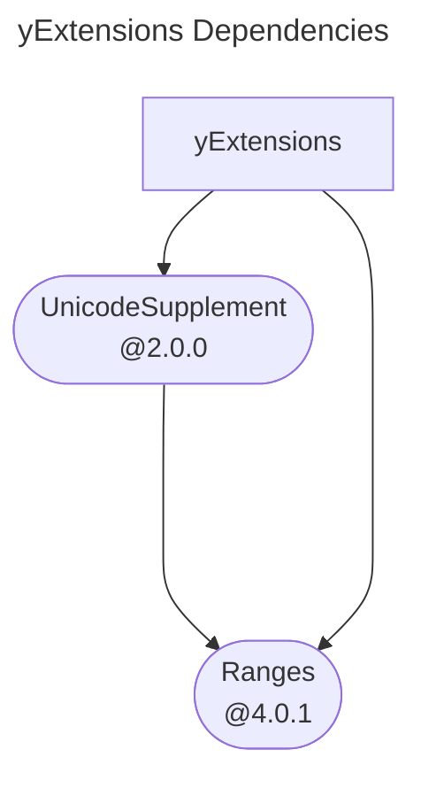

# What is `ySwiftExtensions`?

`ySwiftExtensions` will provide some extensions of Swift Standard Library.  
It was originally written as a part of [SwiftCGIResponder](https://github.com/YOCKOW/SwiftCGIResponder),
and is intended to be used by it.

# Requirements

- Swift 6.2
- macOS(>=13) or Linux

## Dependencies

<!-- SWIFT PACKAGE DEPENDENCIES MERMAID START -->

```mermaid
---
title: yExtensions Dependencies
---
flowchart TD
  swiftranges(["Ranges<br>@4.0.1"])
  swiftunicodesupplement(["UnicodeSupplement<br>@2.0.0"])
  yswiftextensions["yExtensions"]

  click swiftranges href "https://github.com/YOCKOW/SwiftRanges.git"
  click swiftunicodesupplement href "https://github.com/YOCKOW/SwiftUnicodeSupplement.git"

  swiftunicodesupplement ----> swiftranges
  yswiftextensions ----> swiftranges
  yswiftextensions --> swiftunicodesupplement


```
<!-- SWIFT PACKAGE DEPENDENCIES MERMAID END -->

# License

MIT License.  
See "LICENSE.txt" for more information.

