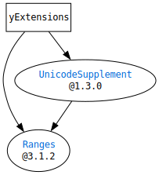

# What is `ySwiftExtensions`?

`ySwiftExtensions` will provide some extensions of Swift Standard Library.  
It was originally written as a part of [SwiftCGIResponder](https://github.com/YOCKOW/SwiftCGIResponder),
and is intended to be used by it.

# Requirements

- Swift 5, 6
- macOS(>=10.15) or Linux

## Dependencies

# License

MIT License.  
See "LICENSE.txt" for more information.

